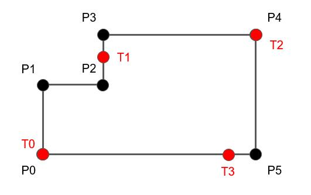
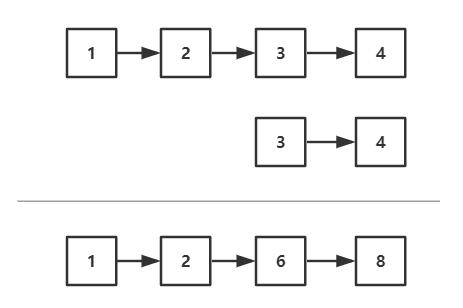

# 今日头条面试真题

- 要求：在`40min`内编程完成下面三题中的两题

### 题目1

有一个n边形(P0, P1, ..., Pn)， 每一条边皆为垂直或水平线段。现给定数值k，以P0为起点将n边形的周长分为k段，每段的长度相等，请打印出k等分点的坐标(T0, T1, ..., Tk）的坐标。

### 题目2

用单向链表表示十进制整数，求两个正整数的和。如下图所示：1234+34=1268，请注意单向链表的方向，不允许使用其他数据结构。

*说明：直接对链表进行操作，结果返回单链表头结点。*

### 题目3

有一组不同高度的台阶，由一个整数数组表示，数组中每个数是台阶的高度。当开始下雨了（水足够多），台阶之间的水坑会积多少水呢？如下图所示，可以用数组表示为` [0,1,0,2,1,0,1,3,2,1,2,1]`，返回积水量6。

`tips`

第2题和LeetCode 2题类似，外加链表反转 `Middle`

第3题对应LeetCode 42题 `Hard`