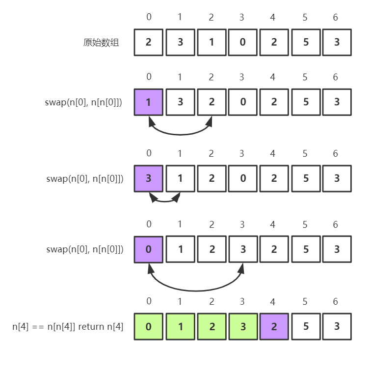

剑指Offer典型题整理 - 争取做最好的题解

# 剑指Offer03-数组中重复的数字

整理时间：2020年02月18日


**题目描述**

```
在一个长度为 n 的数组 nums 里的所有数字都在 0～n-1 的范围内。数组中某些数字是重复的，但不知道有几个数字重复了，也不知道每个数字重复了几次。请找出数组中任意一个重复的数字。
```


**示例**

```
输入：
[2, 3, 1, 0, 2, 5, 3]
输出：2 或 3 
```


**限制：**

```
2 <= n <= 100000
```


**题解**

这道题做起来，但是作为一个面试题，他有很多可以深挖的知识点：

- 你是否会和面试官讨论时间复杂度以及空间复杂度的要求？
- 如果要求空间复杂度为O(1)应该怎么做呢？


😊 解法1：hash

由于n个数字均在[0, n-1]，而且n的最大值为100000，因此可以申请一个大小为100001的数组并全部初始化为0，逐个将nums中的数字添加到对应的位置，如果在某个位置的计数值大于1直接返回即可。这个方法的缺点是比较占空间，空间复杂度O(n)。

`python版本`

```python
class Solution(object):
    def findRepeatNumber(self, nums):
        """
        :type nums: List[int]
        :rtype: int
        """
        dp = [0 for i in range(len(nums))]
        for num in nums:
            if dp[num] == 1:
                return num
            dp[num] += 1
        return -1
```


😐 解法2：排序后从前往后查找是否存在重复

时间复杂度O(nlogn)，空间复杂度O(1)

`python版本`

```python
class Solution(object):
    def findRepeatNumber(self, nums):
        """
        :type nums: List[int]
        :rtype: int
        """
        nums.sort()
        for i in range(1,len(nums)):
            if nums[i]==nums[i-1]:
                return nums[i]
```


😮 解法3：桶排序+抽屉原理

> 桌上有十个苹果，要把这十个苹果放到九个*抽屉*里，无论怎样放，我们会发现至少会有一个*抽屉*里面放不少于两个苹果。这一现象就是我们所说的“*抽屉原理*”。

这个方法是`解法1`的进一步优化，解法1申请了一个等大的空间用于存储hash，那么能不能在nums数组的基础上直接进行映射？可以通过将数组中的每一个数字映射到对应的数组下标下面实现！这里利用到了抽屉原理：一个数组下标只能对应一个数字，如果对应两个及以上数字则说明当前下标对应的数字重复了。

使用抽屉原理和桶排序的思想，可以在O(1)的空间复杂度内完成这道题目。

图解：



`python版本`

```python
class Solution(object):
    def findRepeatNumber(self, nums):
        """
        :type nums: List[int]
        :rtype: int
        """
        for i in range(len(nums)):
            while nums[i] != i:
                if nums[i] == nums[nums[i]]:
                    return nums[i]
                nums[nums[i]], nums[i] = nums[i], nums[nums[i]]
        return -1
```

`C++版本`

```C++
class Solution {
public:
    int findRepeatNumber(vector<int>& nums) {
        for (int i = 0; i < nums.size(); i++) {
            while (nums[i] != i) {
                if (nums[i] == nums[nums[i]]) {
                    return nums[i];
                }
                int temp = nums[nums[i]];
                nums[nums[i]] = nums[i];
                nums[i] = temp;
            }
        }
        return -1;
    }
};
```


(完)