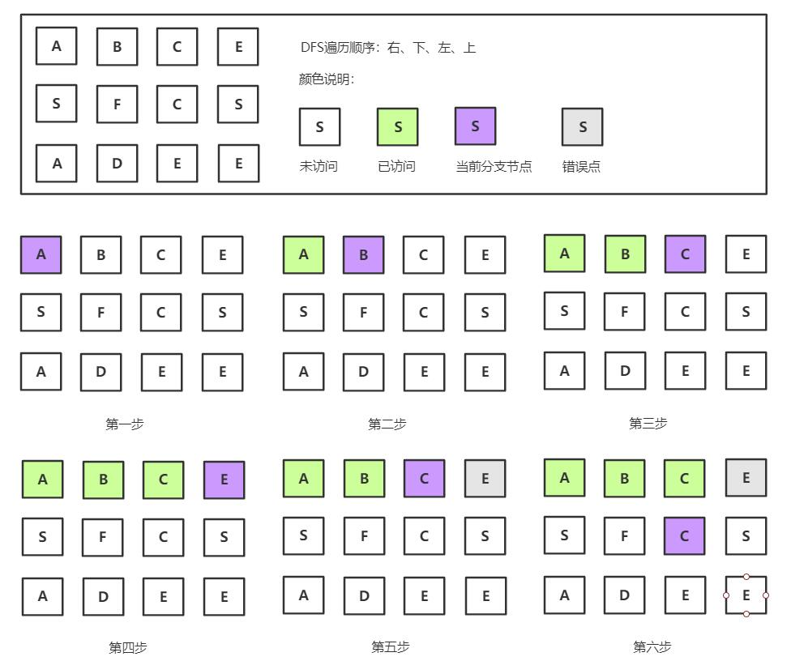
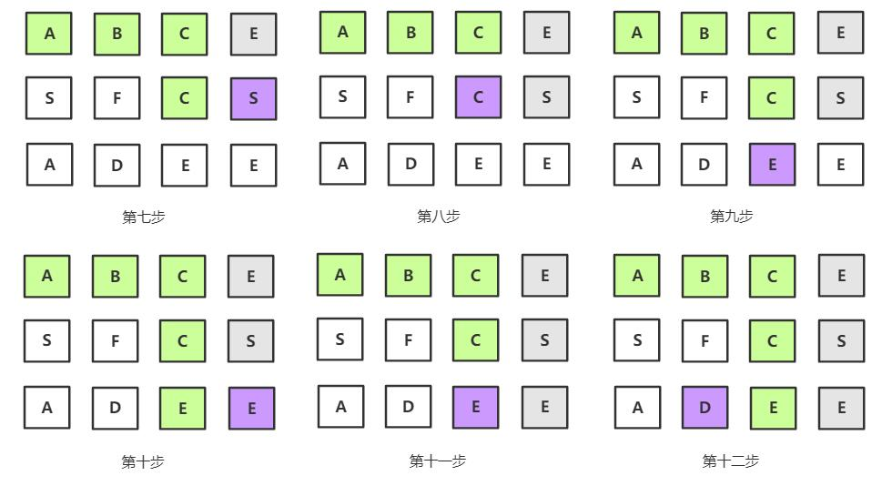

剑指Offer典型题整理 - 争取做最好的题解

# 剑指Offer12-矩阵中的路径

整理时间：2020年02月18日

*本题和 LeetCode-79 相同*


**题目描述**

```
请设计一个函数，用来判断在一个矩阵中是否存在一条包含某字符串所有字符的路径。路径可以从矩阵中的任意一格开始，每一步可以在矩阵中向左、右、上、下移动一格。如果一条路径经过了矩阵的某一格，那么该路径不能再次进入该格子。例如，在下面的3×4的矩阵中包含一条字符串“bfce”的路径（路径中的字母用加粗标出）。

[["a","b","c","e"],
["s","f","c","s"],
["a","d","e","e"]]

但矩阵中不包含字符串“abfb”的路径，因为字符串的第一个字符b占据了矩阵中的第一行第二个格子之后，路径不能再次进入这个格子。
```


**示例**

```
示例 1：
输入：board = [["A","B","C","E"],["S","F","C","S"],["A","D","E","E"]], word = "ABCCED"
输出：true

示例 2：
输入：board = [["a","b"],["c","d"]], word = "abcd"
输出：false
```


**限制：**

```
1 <= board.length <= 200
1 <= board[i].length <= 200
```


**题解**

这道题其实没有什么难点，就是一道常规的DFS题目，权当作DFS题目模板吧，通过下面的图示体会一下：





`C++版本`

```C++
class Solution {
public:
    bool dfs(const vector<vector<char>>& board, vector<vector<int>>& visit_flag, int row, int col, string& word, int depth) {
        if (depth == word.length()) {
            return true;
        }
        int directions[4][2] = {{0, 1}, {0, -1}, {1, 0}, {-1, 0}};
        bool ans = false;
        for (int i = 0; i < 4; i++) {
            int row_ = row + directions[i][0];
            int col_ = col + directions[i][1];
            if (row_ >= 0 && row_ < board.size() && col_ >= 0 && col_ < board[0].size() && visit_flag[row_][col_] == 0 && board[row_][col_] == word[depth]) {
                visit_flag[row_][col_] = 1;
                ans = ans || dfs(board, visit_flag, row_, col_, word, depth + 1);
                visit_flag[row_][col_] = 0;
            }
        }
        return ans;
    }
    bool exist(vector<vector<char>>& board, string word) {
        vector<vector<int>> visit_flag(board.size());
        for (int i = 0; i < board.size(); i++) {
            visit_flag[i].resize(board[0].size());
        } 
        for (int i = 0; i < board.size(); i++) {
            for (int j = 0; j < board[0].size(); j++) {
                if (board[i][j] == word[0]) {
                    visit_flag[i][j] = 1;
                    bool ans = dfs(board, visit_flag, i, j, word, 1);
                    visit_flag[i][j] = 0;
                    if (ans) {
                        return true;
                    }
                }
            }
        }
        return false;
    }
};
```

`python版本`

```python
class Solution(object):
    def exist(self, board, word):
        def dfs(visited, word, row, col):
            if len(word) == 0:
                return True
            
            visited[row][col] = 1
            for d in [[0, 1], [0, -1], [1, 0], [-1, 0]]:
                row_, col_ = row + d[0], col + d[1]
                if row_ >= 0 and row_ < len(board) and col_ >= 0 and col_ < len(board[0]) and board[row_][col_] == word[0]:
                    if visited[row_][col_] == 1:
                        continue
                    if dfs(visited, word[1:], row_, col_):
                        return True
            visited[row][col] = 0
            return False

        visited = [[0 for m in range(len(board[0]))] for n in range(len(board))]
        for i in range(len(board)):
            for j in range(len(board[0])):
                if board[i][j] == word[0]:
                    if dfs(visited, word[1:], i, j):
                        return True
        return False
```


(完)