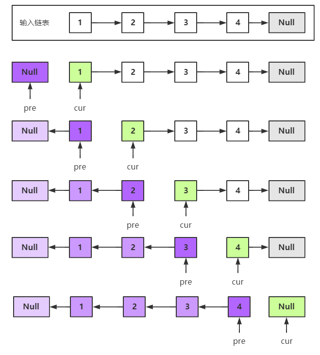
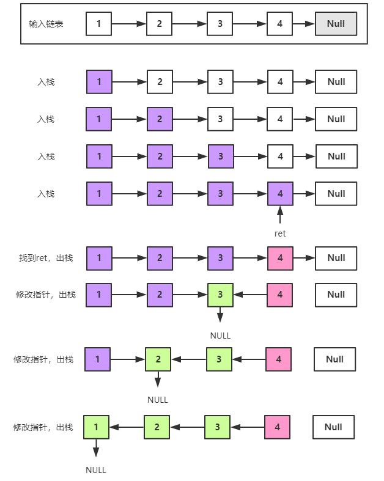

剑指Offer典型题整理 - 争取做最好的题解

# 剑指Offer24-反转链表

整理时间：2020年02月17日

*本题和 LeetCode-206 相同*


**题目描述**

```
定义一个函数，输入一个链表的头节点，反转该链表并输出反转后链表的头节点，使用递归和迭代两种方式实现。
```


**示例**

```
输入: 1->2->3->4->5->NULL
输出: 5->4->3->2->1->NULL
```


**限制：**

```
0 <= 节点个数 <= 5000
```


**题解**

这是一道非常经典的题目了，递归和迭代两种实现实现方法更是能够体现基本编程素养。

😊解法1：双指针迭代法

需要使用到两个指针，指针`cur`定位原先链表的头，指针`pre`定位逆转链表的头。解决这种问题最好的方法还是画图自己分析，流程图如下：



`C++版本`

```C++
/**
 * Definition for singly-linked list.
 * struct ListNode {
 *     int val;
 *     ListNode *next;
 *     ListNode(int x) : val(x), next(NULL) {}
 * };
 */
class Solution {
public:
    ListNode* reverseList(ListNode* head) {
        ListNode *pre = NULL;
        ListNode *cur = head;
        while (cur != NULL) {
            ListNode *temp = cur->next;
            cur->next = pre;
            pre = cur;
            cur = temp;
        }
        return pre;
    }
};
```

`python版本`

```python
# Definition for singly-linked list.
# class ListNode(object):
#     def __init__(self, x):
#         self.val = x
#         self.next = None

class Solution(object):
    def reverseList(self, head):
        """
        :type head: ListNode
        :rtype: ListNode
        """
        pre, cur = None, head
        while cur:
            pre, cur.next, cur = cur, pre, cur.next
        return pre
```


😐 解法2：递归解法

这道题用递归求解还是比较绕的，很容易绕晕，我总结的经验如下：

1. 找整个递归的终止条件：何时终止递归？
2. 找返回值：应该给上一层递归返回什么信息？
3. 本层递归应该做什么：在这一层递归中应该完成哪些内容？

在这个题目中逐一分析：

1. 终止条件即当前节点为链表的最后一个节点`head.next == None`或者链表本身为空`head == None`：

   ```python
   if head == None or head.next == None:
       return head
   ```

2. 因为我们需要最后一个节点作为返回值，所以应该返回原链表最后一个节点（最后一个入栈的节点，即1中返回的节点）：

   ```python
   return ret
   ```

3. 在当前递归中应该将当前层next节点的next指针指向当前层节点；另外为了避免链表最终成环，需要将当前层的节点的next置为空：

   ```python
   head.next.next = head
   head.next = None
   ```


图解：




`C++版本`

```C++
/**
 * Definition for singly-linked list.
 * struct ListNode {
 *     int val;
 *     ListNode *next;
 *     ListNode(int x) : val(x), next(NULL) {}
 * };
 */
class Solution {
public:
    ListNode* reverseList(ListNode* head) {
        if (head == NULL || head->next == NULL) {
            return head;
        }
        ListNode *ret = reverseList(head->next);
        head->next->next = head;
        head->next = NULL;
        return ret;
    }
};
```

`python版本`

```python
# Definition for singly-linked list.
# class ListNode(object):
#     def __init__(self, x):
#         self.val = x
#         self.next = None

class Solution(object):
    def reverseList(self, head):
        """
        :type head: ListNode
        :rtype: ListNode
        """
        if head == None or head.next == None:
            return head
        ret = self.reverseList(head.next)
        head.next.next = head
        head.next = None
        return ret
```


(完)