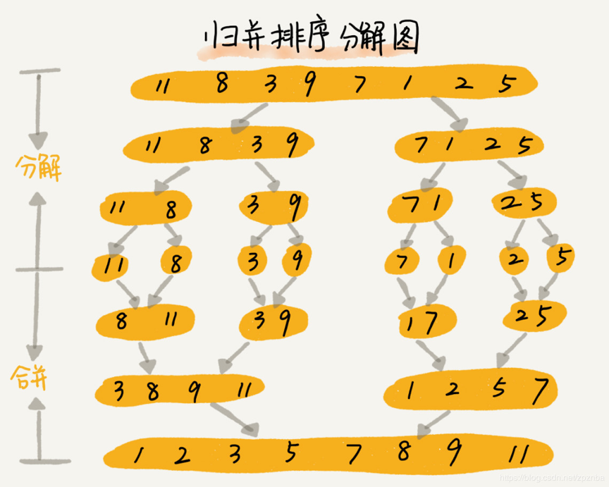

剑指Offer典型题整理 - 争取做最好的题解

# 剑指Offer51-数组中的逆序对

整理时间：2020年02月29日


### 1 题目描述

在数组中的两个数字，如果前面一个数字大于后面的数字，则这两个数字组成一个逆序对。输入一个数组，求出这个数组中的逆序对的总数。


**示例**

```
输入: [7,5,6,4]
输出: 5
```


**限制：**

- 0 <= 数组长度 <= 50000


### 2 题解

面试的时候我把暴力解法代码扔给面试官之后，面试官把我扔了出去。

#### 归并排序思想求解

利用归并排序计算逆序数对的方法太巧妙了，但是只要提醒你一下使用分治思想，或者使用归并排序思想解决这道问题你可能就有思路了。归并排序实际上会把数组分成两个有序部分，我们不妨称其为左和右，归并排序的过程中会将左右两部分合并成一个有序的部分，对于每一个左右部分，我们分别计算其逆序数，然后全部加起来就是我们要求的逆序数，详细的思路在代码中注释了。

顺带复习一下归并排序：




`C++代码`

```cpp
class Solution {
public:
	int ans = 0;
    
    // 归并排序函数框架
    void mergeSort(vector<int>& nums, int start, int end) {
        if (end - start <= 1) return;
		
        // 将当前数组一分为二，左右各自进行归并排序，左闭右开
        int mid = (start + end) / 2;
        mergeSort(nums, start, mid);
        mergeSort(nums, mid, end);

        // 归并数组
        vector<int> temp(end - start);
        int ptr1 = start, ptr2 = mid, ptr3 = 0;
        while (ptr1 < mid && ptr2 < end) {
            if (nums[ptr1] <= nums[ptr2]) {
                temp[ptr3++] = nums[ptr1++];
            }
            else {
                // 如果左子数组当前最小值大于右子数组当前最小值，找到逆序对数目为mid-ptr
                ans += mid - ptr1;
                temp[ptr3++] = nums[ptr2++];
            }
        }
        while (ptr1 < mid) temp[ptr3++] = nums[ptr1++];
        while (ptr2 < end) temp[ptr3++] = nums[ptr2++];
        
        // 将排好序的结果写回原数组
        for (int i = 0; i < end - start; i++) nums[i + start] = temp[i];
    }

    int reversePairs(vector<int>& nums) {
        mergeSort(nums, 0, nums.size());
        return ans;
    }
};
```


(完)

