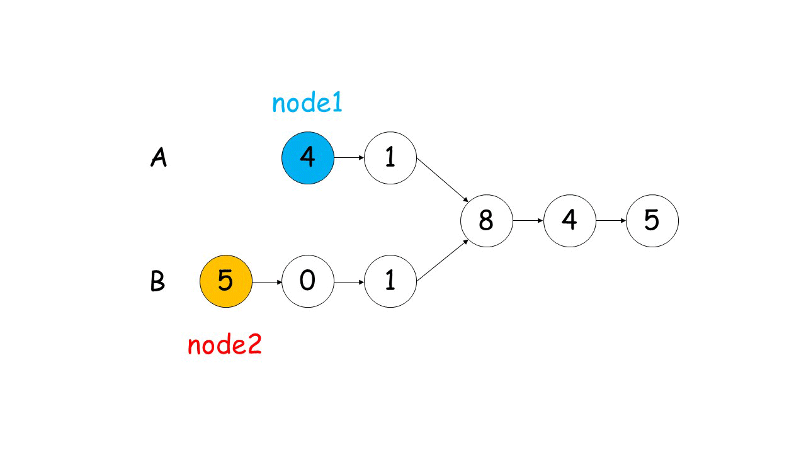

剑指Offer典型题整理 - 争取做最好的题解

# 剑指Offer52-两个链表的第一个公共节点

整理时间：2020年02月21日

*本题和 LeetCode 160题相同*


### 1 题目描述

输入两个链表，找出它们的第一个公共节点。


**注意**

```
如果两个链表没有交点，返回 null.
在返回结果后，两个链表仍须保持原有的结构。
可假定整个链表结构中没有循环。
程序尽量满足 O(n) 时间复杂度，且仅用 O(1) 内存。
```


### 2 题解

链表题最适合画图分析了~

#### 2.1 快慢指针1

这是我第一个想到的做法：首先遍历两个链表得到长度l1和l2，然后让较长的链表先往后移动`abs(l1-l2)`个位置，最后两个指针一直往后移动直至两个指针相等。比较简单，直接用python实现吧。

`python代码`

```python
class Solution(object):
    def getIntersectionNode(self, headA, headB):
        len1, len2 = 0, 0
        # 计算链表1的长度
        head = headA
        while head:
            len1 += 1
            head = head.next
        # 计算链表2的长度
        head = headB
        while head:
            len2 += 1
            head = head.next
        
        # 将长的链表先移动
        while len1 - len2 > 0:
            headA = headA.next
            len1 -= 1
        while len2 - len1 > 0:
            headB = headB.next
            len2 -= 1

        while headA != headB:
            headA = headA.next
            headB = headB.next
        
        return headA
```

#### 2.2 快慢指针2

这是一种更高明的解法，而且代码短小精悍！主要思路：让两个链表分别从head开始往后移动，如果链表1的指针到达尾部则将其重新定位到链表2的头部；对于链表2的指针进行同样的处理。这样一来，如果链表1和链表2存在交点，这两个指针在同时到达交点的时候移动的步数是一样的；如果链表1和链表2没有交点，两个指针会在将两个链表各遍历一遍之后停止在两个链表的末尾，此时ptr1 == ptr2 == None。

这里借用一下[题解中的配图](https://leetcode-cn.com/problems/liang-ge-lian-biao-de-di-yi-ge-gong-gong-jie-dian-lcof/solution/shuang-zhi-zhen-fa-lang-man-xiang-yu-by-ml-zimingm/)：



`python代码`

```python
# Definition for singly-linked list.
# class ListNode(object):
#     def __init__(self, x):
#         self.val = x
#         self.next = None

class Solution(object):
    def getIntersectionNode(self, headA, headB):
        """
        :type head1, head1: ListNode
        :rtype: ListNode
        """
        if not headA or not headB: return None
        head1, head2 = headA, headB
        while head1 != head2:
            head1 = headB if head1 == None else head1.next
            head2 = headA if head2 == None else head2.next
        return head1
```

(完)