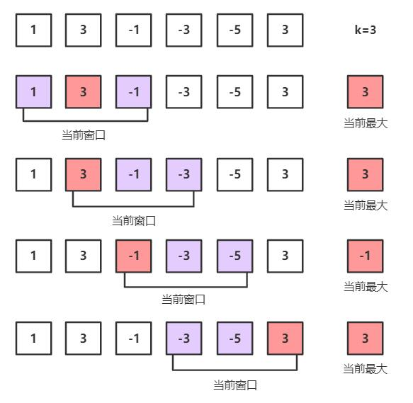
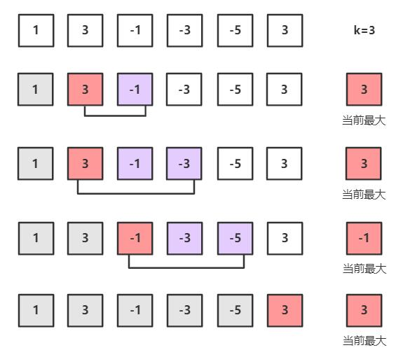

剑指Offer典型题整理 - 争取做最好的题解

# 剑指Offer59-滑动窗口的最大值

整理时间：2020年02月19日

*本题和 LeetCode-239 相同*


### 1 题目描述

给定一个数组 nums 和滑动窗口的大小 k，请找出所有滑动窗口里的最大值。


**示例**

```
输入: nums = [1,3,-1,-3,5,3,6,7], 和 k = 3
输出: [3,3,5,5,6,7] 
解释: 

  滑动窗口的位置                最大值
------------------------------------
[1  3  -1] -3  5  3  6  7       3
 1 [3  -1  -3] 5  3  6  7       3
 1  3 [-1  -3  5] 3  6  7       5
 1  3  -1 [-3  5  3] 6  7       5
 1  3  -1  -3 [5  3  6] 7       6
 1  3  -1  -3  5 [3  6  7]      7

```


### 2 题解

看似简单的一道题，内有大乾坤！

#### 2.1 暴力法 O(n·k)

最容易想到的也肯定能想到的就是暴力法了，时间复杂度$O(k·n)$，写法如下：

```python
class Solution(object):
    def maxSlidingWindow(self, nums, k):
        if len(nums) == 0:
            return []
        ans = []
        for i in range(len(nums) - k + 1):
            cur_min = nums[i]
            for j in range(i, i + k):
                cur_min = max(cur_min, nums[j])
            ans.append(cur_min)
        return ans
```

#### 2.2 暴力解法优化

暴力解法中包含了许多重复的不必要的判断，如果能够避免这些额外的判断也能大大的降低其复杂度，如下图中第1和第2个窗口的最大值均为同一个值`3`，在这时候加上一些判断就能避免重新在窗口中遍历一遍。其算法思路如下：

1. 使用双指针left, right确定窗口左右边界首先得到最左边的窗口，并求得该窗口中的最大值cur_max，将当前的cur_max加入到ans数组中，将窗口右移一格（left += 1, right += 1）；
2. 如果right等于len(nums), 结束；否则，判断最右边的新的数字是否大于cur_max:
   - 如果nums[right] >= cur_max，修改cur_max = nums[right]
   - 如果nums[right] < cur_max，判断nums[left - 1]是否等于cur_max
     - 如果nums[left] - 1 == cur_max，说明之前的最大值失效了，需要在[left, right]中重新寻找cur_max
     - 如果nums[left - 1] != cur_max，说明之前的最大值仍然在[left, right]中，cur_max不变
3. 将cur_max添加到ans中，并将窗口右移一格，回到第2步。



`C++代码`:

```C++
class Solution {
public:
    vector<int> maxSlidingWindow(vector<int>& nums, int k) {
        if (nums.size() == 0 || k == 1) {
            return nums;
        }
        int cur_max = nums[0];
        for (int i = 1; i < k; i++) {
            if (nums[i] > cur_max) cur_max = nums[i];
        }
        vector<int> ans;
        ans.push_back(cur_max);
        int left = 1;
        int right = k;
        while (right < nums.size()) {
            if (nums[right] >= cur_max) {
                cur_max = nums[right];
            }
            else if (nums[left - 1] == cur_max) {
                cur_max = nums[left];
                for (int i = left; i <= right; i++) {
                    if (nums[i] > cur_max) cur_max = nums[i];
                }
            }
            ans.push_back(cur_max);
            left += 1;
            right += 1;
        }
        return ans;
    }
};
```

`python代码`：

```python
class Solution(object):
    def maxSlidingWindow(self, nums, k):
        """
        :type nums: List[int]
        :type k: int
        :rtype: List[int]
        """
        if len(nums) == 0 or k == 1:
            return nums
        cur_max = max(nums[0:k])
        ans = [cur_max]
        left, right = 1, k
        while right < len(nums):
            if nums[right] >= cur_max:
                cur_max = nums[right]
            elif nums[left - 1] == cur_max:
                cur_max = max(nums[left:right + 1])
            ans.append(cur_max)
            left += 1
            right += 1
        return ans
```

#### 2.3 使用优先级队列/堆

有没有数据结构能够一直返回最值呢？答案是堆。在最大堆中堆顶元素永远是最大的元素，而且在大小为k的堆中插入一个元素的时间复杂度为$O(logk)$，算法整体的时间复杂度为$O(nlogk)$。

不过这道题使用堆并不是一个明智的选择，因为需要频繁的插入堆删除堆，而且时间复杂度也并不低，因此不写代码实现这个笨方法了。在python中可以通过`import heapq`使用堆，python中heapq的部分函数使用方法：

```python
import heapq
# 需要说明：heapq中只有小顶堆，没有大顶堆，如果要使用大顶堆，可以取负数

# 创建heap方法1：使用heapq.heappush(heap_name, val)逐个添加
nums = [2, 3, 5, 1, 54, 23, 132]
heap = []
for num in nums:
    heapq.heappush(heap, num)
    
# 创建heap方法2：使用heapq.heapify(arr)直接添加整个数组，nums就会变为一个堆
heapq.heapify(nums)

# 弹出最小值
heapq.heappop(heap)

# 打印最小值
heapq[0]

# 堆排序结果
print([heapq.heappop(heap) for _ in range(len(nums))])

# 删除堆中最小元素并加入一个元素
heapq.heapreplace(nums, 23)

# 获取堆中的k个最大值或最小值
heapq.nlargest(k, nums)
heapq.nsmallest(k, nums)
```


#### 2.4 双端队列`deque`

方法2.2已经将暴力解法优化到了极限，然而在最差的情况下（整个数组是降序的）还是需要O(n·k)的时间复杂度。那么有没有更好的解法呢？在LeetCode题解上我看到了大佬们的解法-通过借助双端队列deque可以在O(1)的时间复杂度内计算出每个窗口的最大值。

主要的思路是维护一个单调递减的队列，因此队列最左边的元素就是最大的。由于在窗口右移的过程中，需要不断地把窗口最左边的数字去除，队列中存储的是数字在nums数组中的索引。下图中有颜色的方框表示在队列中的数。



下面的代码是使用数组模拟双端队列的简化版本代码：

`python代码`

```python
from collections import deque
class Solution(object):
    def maxSlidingWindow(self, nums, k):
        ans, window = [], []
        for i, num in enumerate(nums):
            if i >= k and window[0] <= i - k: window.pop(0)
            while window and nums[window[-1]] <= num:
                window.pop()
            window.append(i)
            if i >= k - 1:
                ans.append(nums[window[0]])
        return ans
```


另外，在python的collections模块内置了deque，其次该模块还有如下容器：

> collections模块实现了特定目标的容器，以提供Python标准内建容器 dict、list、set、tuple 的替代选择。
>
> - Counter：字典的子类，提供了可哈希对象的计数功能
> - defaultdict：字典的子类，提供了一个工厂函数，为字典查询提供了默认值
> - OrderedDict：字典的子类，保留了他们被添加的顺序
> - namedtuple：创建命名元组子类的工厂函数
> - deque：类似列表容器，实现了在两端快速添加(append)和弹出(pop)
> - ChainMap：类似字典的容器类，将多个映射集合到一个视图里面


下面的代码来自[LeetCode官方题解](https://leetcode-cn.com/problems/sliding-window-maximum/solution/hua-dong-chuang-kou-zui-da-zhi-by-leetcode-3/)， 使用deque实现：

`python代码`

```python
from collections import deque
class Solution(object):
    def maxSlidingWindow(self, nums, k):
        # base cases
        n = len(nums)
        if n * k == 0:
            return []
        if k == 1:
            return nums
        
        def clean_deque(i):
            # remove indexes of elements not from sliding window
            if deq and deq[0] == i - k:
                deq.popleft()
                
            # remove from deq indexes of all elements 
            # which are smaller than current element nums[i]
            while deq and nums[i] > nums[deq[-1]]:
                deq.pop()
        
        # init deque and output
        deq = deque()
        max_idx = 0
        for i in range(k):
            clean_deque(i)
            deq.append(i)
            # compute max in nums[:k]
            if nums[i] > nums[max_idx]:
                max_idx = i
        output = [nums[max_idx]]
        
        # build output
        for i in range(k, n):
            clean_deque(i)          
            deq.append(i)
            output.append(nums[deq[0]])
        return output
```


(完)