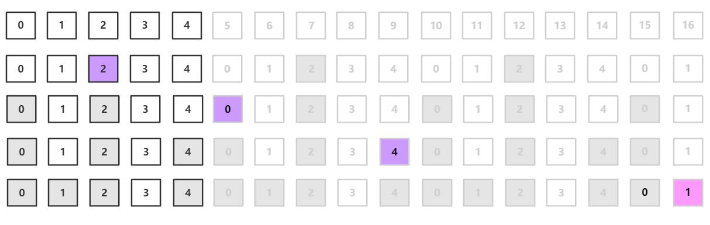

剑指Offer典型题整理 - 争取做最好的题解

# 剑指Offer62. 圆圈中最后剩下的数字

整理时间：2020年02月23日


### 1 题目描述

0,1,...,n-1这n个数字排成一个圆圈，从数字0开始，每次从这个圆圈里删除第m个数字。求出这个圆圈里剩下的最后一个数字。

例如，0、1、2、3、4这5个数字组成一个圆圈，从数字0开始每次删除第3个数字，则删除的前4个数字依次是2、0、4、1，因此最后剩下的数字是3。


**示例**

```
输入: n = 5, m = 3
输出: 3

输入: n = 10, m = 17
输出: 2
```


**限制：**

- `1 <= n <= 10^5`
- `1 <= m <= 10^6`


### 2 题解

之前写约瑟夫环一直都是用的链表模拟，而且一直以为就这一种方法。其实约瑟夫环问题可以通过找规律的方法很轻松解决，一起来看看吧。约瑟夫环问题示意图如下：




#### 2.1 链表模拟

这个题目并没什么悬念，如果要模拟的生成一个循环单链表模拟即可，使用C/C++的话注意delete就好了，使用C++纯手撸的循环单链表代码如下：

`C++代码`

```cpp
class Node {
public:
    int val;
    Node* next;
    Node(int v) : val(v) {}
};

class Solution {
public:
    int lastRemaining(int n, int m) {
        // 建立链表环
        Node* head = new Node(-1);
        Node* pre;
        Node* cur = head;
        for (int i = 0; i < n; i++) {
            Node* new_node = new Node(i);
            cur->next = new_node;
            cur = new_node;
        }
        cur->next = head->next;

        // 开始游戏吧！
        int counter = n;
        pre = cur;
        cur = head->next;
        delete head;
        while (counter != 1) {
            int tick = 1;
            while (tick < m) {
                pre = pre->next;
                cur = cur->next;
                tick++;
            }
            pre->next = cur->next;
            delete cur;
            cur = pre->next;
            counter--;
        }
        int ret = cur->val;
        delete cur;
        return ret;
    }
};
```

上面的44行代码完成了约瑟夫环的模拟，然鹅很不幸会超时（其实看题目给的m和n的规模就能猜到），模拟法的时间复杂度为$O(mn)$，因此我们必须另寻他法。


#### 2.2 公式递推法

这个方法是从模拟的过程中寻找规律，有点点dp的味道，真的tql，orz。具体思路如下：

定义函数$f(n,m)$表示n个数字，删除第m个数字的约瑟夫环问题最终的答案。每删掉一个数字，下一个数字成为头，相当于把数组向前移动M位。若已知$f(n−1,m)$的结果，则$f(n,m)$的结果就是$f(n−1,m)$的结果往后移动m位(因为有可能数组越界，超过的部分会被接到头上，所以要模n)，即得到递推公式为：
$$
f(n,m) = (f(n-1, m) + m) \% n
$$
关于详细的解释见[1]，于是该问题就可以用以下代码实现：

`C++代码`

```cpp
class Solution {
public:
    int lastRemaining(int n, int m) {
        int res = 0;
        for (int i = 2; i <= n; i++) {
            res = (res + m) % i;
        }
        return res;
    }
};
```

想要酷酷的一行代码吗？不过这个是没有备忘录的自顶向下的递归，**会超时**嗷，只能拿来装*：

`python代码`

```python
class Solution(object):
    def lastRemaining(self, n, m):
        return 0 if n == 1 else (self.lastRemaining(n - 1, m) + m) % n;
```


### 3 推荐资料

[1] [CSDN - 约瑟夫环——公式法（递推公式）](https://blog.csdn.net/u011500062/article/details/72855826)


(完)

