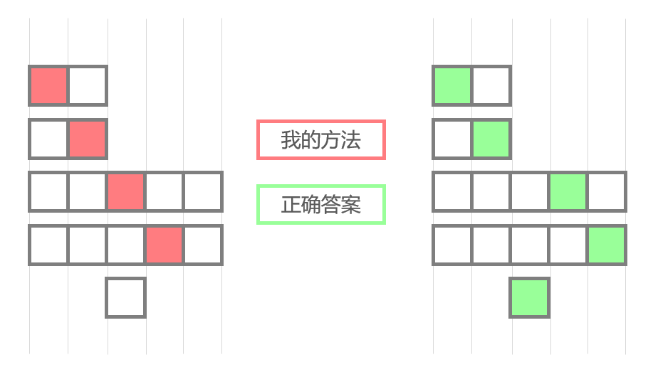

LeetCode第4篇题解

# LeetCode1353-最多可以参加的会议数目

`Middle` `贪心` 

整理时间：2020年02月25日


### 1 题目描述

给你一个数组 events，其中 events[i] = [startDayi, endDayi] ，表示会议 i 开始于 startDayi ，结束于 endDayi 。

你可以在满足 startDayi <= d <= endDayi 中的任意一天 d 参加会议 i 。注意，一天只能参加一个会议。

请你返回你可以参加的最大会议数目。


**示例**

```
输入：events = [[1,2],[2,3],[3,4]]
输出：3
解释：你可以参加所有的三个会议。
安排会议的一种方案如上图。
第 1 天参加第一个会议。
第 2 天参加第二个会议。
第 3 天参加第三个会议。
```


### 2 题解

这种题目，不是贪心就是动态规划，能贪那就先试试贪心行不行，不行拉倒。

#### 2.1 我尝试的贪心算法（错误的）

先试了几个数据，发现可以按照下面的思路进行：

- 首先对数据进行排序：先开始的在前，开始时间相同的就让持续时间短的在前面（优先选择结束较早的）
- 然后贪心策略，从前往后选就完事了。

`C++代码`

```cpp
#include <algorithm>

class Solution {
public:
    int maxEvents(vector<vector<int>>& events) {
        sort(events.begin(), events.end(), [](const vector<int>& e1, const vector<int>& e2) {
            if (e1[0] == e2[0]) return e1[1] - e1[0] <= e2[1] - e2[0];
            return e1[0] <= e2[0];
        });

        int ans = 0;
        int next_start = 1;
        for (int i = 0; i < events.size(); i++) {
            if (events[i][1] >= next_start) {
                next_start = min(next_start + 1, events[i][1] + 1);
                ans++;
            }
        }
        return ans;
    }
};
```

看着整挺好，然鹅提交之后发现不行，可能出现下面的情况：



所以这个贪心思想不太行，需要改进。


#### 2.2 使用优先队列的贪心算法

前面的算法的主要问题在于：我们只在最开始对会议按照开始时间和持续天数进行排序，但是对于第i天而言，第i天之前的会议已经无法参加了，因此之前的排序结果就不靠谱了，所以会出现上面的错误。

解决办法[1]：

- 按照会议开始日期对 events 升序排序
- 使用一个优先队列，将今天开始的会议全都加入到优先队列中
- 优先队列的排序以会议的结束日期为标准，保证越接近结束日期的越靠前（按照贪心的思想，优先选择优先队列里结束早的会议）
- 每一天如果优先队列里还有会议，就去参加一个
- 新的一天，先把优先队列里已经过期的会议清除掉

```cpp
#include <algorithm>

class Solution {
public:
    int maxEvents(vector<vector<int>>& events) {
        // 按照会议开始时间进行排序，升序
        sort(events.begin(), events.end());

        // 定义优先队列
        priority_queue<int, vector<int>, greater<int>> que;

        int ans = 0;
        int next_start = 0;
        int i = 0;
        while (i < events.size() || !que.empty()) {
            next_start ++;
            // 清空无效的会议
            while (!que.empty() && que.top() < next_start) que.pop();
            while (i < events.size() && events[i][0] == next_start) {
                que.push(events[i][1]);
                i++;
            }
            // 如果当天没有会议
            if (que.empty()) continue;
            que.pop();
            ans ++;
        }
        return ans;
    }
};
```

*特别说明：STL中的`priority_queue`默认为大顶堆，如果想要使用小顶堆可以定义如下：

```cpp
// 定义小顶堆需要使用greater<T>，而不是less<T>
priority_queue<int, vector<int>, greater<int> > q;

// 大顶堆也可这样定义
priority_queue<int, vector<int>, less<int> > q;
```


### 参考

[1] https://leetcode-cn.com/problems/maximum-number-of-events-that-can-be-attended/solution/5342-by-ikaruga/