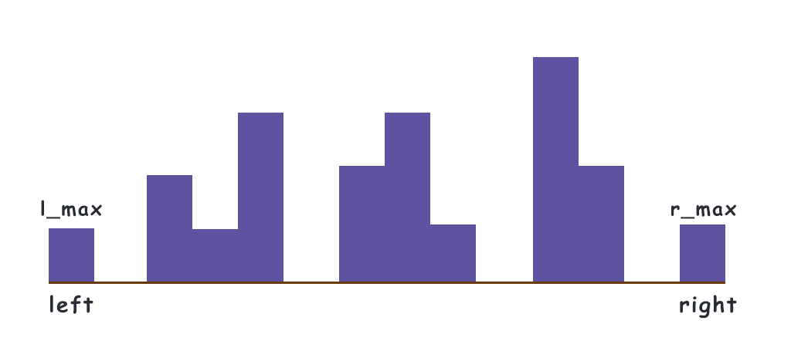

剑指Offer典型题整理 - 争取做最好的题解

# LeetCode42-接雨水

`Hard` `双指针` 

整理时间：2020年02月25日


### 1 题目描述

给定 *n* 个非负整数表示每个宽度为 1 的柱子的高度图，计算按此排列的柱子，下雨之后能接多少雨水。


**示例**

```
输入: [0,1,0,2,1,0,1,3,2,1,2,1]
输出: 6
```


### 2 题解

这题一看就来者不善，滑动窗口好像不太管用，双指针又想不明白应该怎么用...

#### 2.1 一层一层计算

这是我看到这道题最先想到的做法，从下往上一层一层计算每层可以接的雨水，把结果累加起来不就好了，而且这样就可以直接使用对撞指针求解了！于是我高兴的写下如下代码，提交之后发现：`314 / 315 个通过测试用例`🙂，剩下的一个TLE了，看样子这个方法不太行呀。

`C++代码`

```cpp
#include <algorithm>
class Solution {
public:
    int trap(vector<int>& height) {
        if (height.size() < 3) return 0;
        auto max_value = max_element(height.begin(), height.end());
        int ans = 0;
        for (int i = 1; i <= *max_value; i++) {
            int left = 0, right = height.size() - 1;
            while (height[left] < i) left ++;
            while (height[right] < i) right --;
            while (left < right) {
                if (height[left++] < i) ans += 1;
            }
        }
        return ans;
    }
};
```

*时间复杂度$O(m·n)$，n为数组中最大数字的值，空间复杂度$O(1)$。


`以下分析内容不是我自己想出来的，我太菜了orz`

#### 2.2 暴力解发

既然上面按行的方法行不通，那就按列呗。最暴力的解法就是：从第1列到第n-2列（假设共有n列）计算每一列能够存储的水量。

`C++代码`

```cpp
#include <algorithm>
class Solution {
public:
    int trap(vector<int>& height) {
        int ans = 0;
        // 从第1个位置开始向右一个一个的算，最左边和最右边肯定存不住水的不用算
        for (int i = 1; i < right; i++) {
            int l_max = 0, r_max = 0;
            // 计算左边[0,i]最大值
            for (int j = i; i >= 0; j--) {
                l_max = max(l_max, height[j]);
            }
            // 计算右边[i,height.size() - 1]最大值
            for (int j = i; j < height.size(); j++) {
                r_max = max(r_max, height[j]);
            }
            // 计算当前列能够存多少水，左边最大和右边最大的较小值减去当前列本身的高度即为存水量
            ans += min(l_max, r_max) - height[i];
        }
        return ans;
    }
};
```

*暴力解法的时间复杂度为$O(n^2)$，空间复杂度为$O(1)$。


#### 2.3 加上备忘录

如果面试官看到你写的这，肯定说：”你不行啊，这闭着眼睛都能写出来“。那怎么办呢？仔细观察后，能够发现暴力解法中每次都需要重复的计算[0, i]以及[i, height.size() - 1]之间的最大值，但其实每次扫描的过程中都有重复扫描的地方，如果能把之前扫描过的地方记下来，那不就okk了嘛。因此可以使用备忘录降低时间复杂度：

```cpp
#include <algorithm>
class Solution {
public:
    int trap(vector<int>& height) {
        if (height.size() == 0) return 0;
        vector<int> l_max(height.size() + 2), r_max(height.size() + 2);
        int ans = 0;
        // 从左往右遍历, l_max[i]存储[0, i]区间的最大值
        for (int i = 1; i < height.size() + 1; i++) {
            l_max[i] = max(l_max[i - 1], height[i - 1]);
        }
        // 从右往左遍历, r_max[i]存储[i, height.size() - 1]区间的最大值
        for (int i = height.size(); i > 0; i--) {
            r_max[i] = max(r_max[i + 1], height[i - 1]);
        }

        // 从第1个位置开始向右一个一个的算，最左边和最右边肯定存不住水的不用算
        for (int i = 1; i < height.size() - 1; i++) {
            // 计算当前列能够存多少水，左边最大和右边最大的较小值减去当前列本身的高度即为存水量
            ans += min(l_max[i + 1], r_max[i + 1]) - height[i];
        }
        return ans;
    }
};
```

*时间复杂度为$O(n)$，空间复杂度为$O(n)$。


#### 2.4 双指针法

备忘录的解法虽然能够AC，但还不是很棒，因为需要占用$O(n)$的空间去存两个数组。使用双指针的方法能够在$O(1)$的时间复杂度内解决这个问题。

```cpp
#include <algorithm>
class Solution {
public:
    int trap(vector<int>& height) {
        if (height.size() == 0) return 0;
        int n = height.size();
        int left = 0, right =n - 1;
        int ans = 0;

        int l_max = height[0], r_max = height[n - 1];
        
        while (left < right) {
            l_max = max(l_max, height[left]);
            r_max = max(r_max, height[right]);

            if (l_max <= r_max) ans += l_max - height[left++];
            else ans += r_max - height[right--];
        }
        return ans;
    }
};
```

*时间复杂度为$O(n)$，空间复杂度为$O(1)$。


那么这个方法是个什么原理呢？为什么它就可行呢？只可意会不可言传，本菜鸡想不到这个方法，直接看图解吧：



