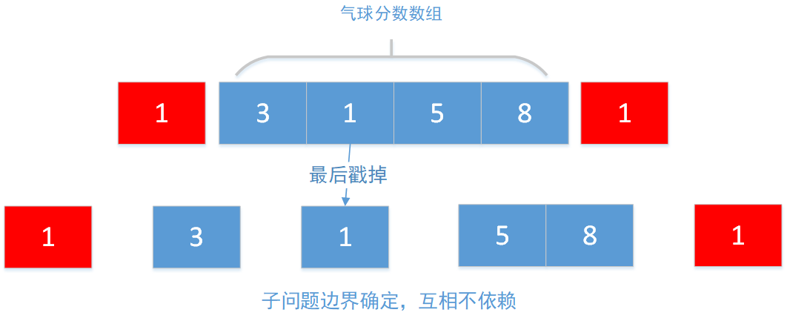

LeetCode动态规划系列

# LeetCode312-戳气球

整理时间：2020年03月05日


### 1 题目描述

有 n 个气球，编号为0 到 n-1，每个气球上都标有一个数字，这些数字存在数组 nums 中。

现在要求你戳破所有的气球。每当你戳破一个气球 i 时，你可以获得 nums[left] * nums[i] * nums[right] 个硬币。 这里的 left 和 right 代表和 i 相邻的两个气球的序号。注意当你戳破了气球 i 后，气球 left 和气球 right 就变成了相邻的气球。

求所能获得硬币的最大数量。

说明:

- 你可以假设 nums[-1] = nums[n] = 1，但注意它们不是真实存在的所以并不能被戳破。
- 0 ≤ n ≤ 500, 0 ≤ nums[i] ≤ 100


**示例**

```
输入: [3,1,5,8]
输出: 167 
解释: nums = [3,1,5,8] --> [3,5,8] -->   [3,8]   -->  [8]  --> []
     coins =  3*1*5      +  3*5*8    +  1*3*8      + 1*8*1   = 167
```


### 2 题解

这个题非常考验分治思想，如何把问题分成互不依赖的小问题。

如果你选取一个气球i，然后先戳破它，那么剩下的两块[0,i-1]和[i+1,nums.size()-1]是互相依赖的，因为左边块的右边界依赖于右边块的最左的气球，同时，右边块的左边界依赖于左边块的最右的气球。这样切分出来的子问题是互相依赖的。

换个思路，我们让选取的气球i作为最后一个戳破的气球，那么左边块和右边块的边界就是固定的，右边的左边界永远是nums[i]，左边的右边界永远是nums[i]。这样子问题之间就不会依赖了。



#### 带缓冲区的回溯法

如果直接用递归做的话，毫无疑问会超时，使用一个缓冲区数组mem[i] [j]来记录nums数据从i到j这一段的最大分数

```c++
tmp = (start-1<0?1:nums[start-1]) * nums[i] * (end+1 >= nums.size()?1:nums[end+1]) 
    	//检查start的前一个和end的后一个元素是不是边界
    	+ (i-1<start?0:goBack(nums,mem,start,i-1)) 
    	//保证start<=i-1,也可以把这个判断放在goBack函数里
    	+ (i+1>end?0:goBack(nums,mem,i+1,end));
```

代码如下：

```c++
class Solution {
public:
    int goBack(vector<int>& nums,vector<vector<int> >&mem,int start,int end){
        if(start <= end){
            if(mem[start][end] != -1)
                return mem[start][end];
        }
        int tmp,maxpoint = 0;
        for(int i=start;i<=end;i++){
            tmp = (start-1<0?1:nums[start-1]) * nums[i] * 
           	(end+1 >= nums.size()?1:nums[end+1]) + 
            (i-1<start?0:goBack(nums,mem,start,i-1)) + 
       	    (i+1>end?0:goBack(nums,mem,i+1,end));
            maxpoint = max(maxpoint,tmp);
        }
        mem[start][end] = maxpoint; 
        return mem[start][end];
    }
    int maxCoins(vector<int>& nums) {
        if(nums.size() == 0) return 0;
        vector<vector<int> >mem;
        mem.resize(nums.size());
        for(int i=0;i<nums.size();i++){
            mem[i].resize(nums.size());
            for(int j=0;j<mem[i].size();j++)
                mem[i][j] = -1;
        }
        return goBack(nums,mem,0,nums.size()-1);
    }
};
```

#### 动态规划

这个题的动态规划十分的有意思，它的第一层循环是子问题的长度，第一次迭代长度为1的子集的最大分数，第二次迭代长度为2的子集的最大分数。。。直到算出长度为num,size()的最大分数。切分子问题的方法也是一样，假定i是最后一个戳的气球，遍历num[start,end];

代码如下

```cpp
class Solution {
public:
    void method(vector<int>& nums,vector<vector<int> >&dp,int start,int end){
        int maxpoint = 0,tmp;
        for(int i=start;i<=end;i++){
            tmp = (start-1<0?1:nums[start-1]) * nums[i] * 
                (end+1>=nums.size()?1:nums[end+1]) + (i-1<start?0:dp[start][i-1]) 
                + (i+1>end?0:dp[i+1][end]);
            //长度小于end-start的问题前面都求解过了，直接查dp数组即可
            maxpoint = max(maxpoint,tmp);
        }
        dp[start][end] = maxpoint;
    } 
    int maxCoins(vector<int>& nums) {
        if(nums.size() == 0) return 0;
        vector<vector<int> >dp;
        dp.resize(nums.size());
        for(int i=0;i<nums.size();i++)
            dp[i].resize(nums.size());
        int tmp,max = 0;
        for(int i=0;i<nums.size();i++){
            for(int j=0;j<nums.size()-i;j++){
                method(nums,dp,j,j+i);
            }	
        }
        return dp[0][nums.size()-1];
    }
};
```


(完)

