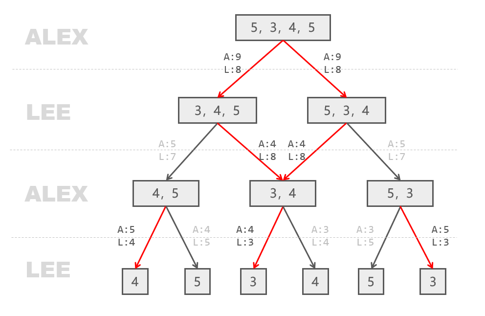
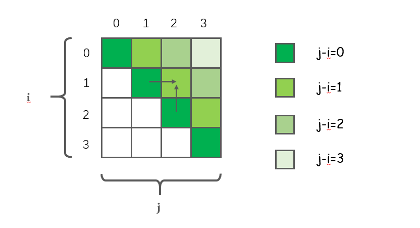

# LeetCode877-石子游戏

整理时间：2020年03月05日


### 1 题目描述

亚历克斯和李用几堆石子在做游戏。偶数堆石子排成一行，每堆都有正整数颗石子 piles[i] 。

游戏以谁手中的石子最多来决出胜负。石子的总数是奇数，所以没有平局。

亚历克斯和李轮流进行，亚历克斯先开始。 每回合，玩家从行的开始或结束处取走整堆石头。 这种情况一直持续到没有更多的石子堆为止，此时手中石子最多的玩家获胜。

假设亚历克斯和李都发挥出最佳水平，当亚历克斯赢得比赛时返回 true ，当李赢得比赛时返回 false 。


**示例**

```
输入：[5,3,4,5]
输出：true
解释：
亚历克斯先开始，只能拿前 5 颗或后 5 颗石子 。
假设他取了前 5 颗，这一行就变成了 [3,4,5] 。
如果李拿走前 3 颗，那么剩下的是 [4,5]，亚历克斯拿走后 5 颗赢得 10 分。
如果李拿走后 5 颗，那么剩下的是 [3,4]，亚历克斯拿走后 4 颗赢得 9 分。
这表明，取前 5 颗石子对亚历克斯来说是一个胜利的举动，所以我们返回 true 。
```


### 2 题解

*如果你看不懂以下题解，恭喜你，你是一个正常人，可以直接跳到2.4放松一下再回来。

#### 2.1 递归

在我一番冥思苦想之后，终于想明白了这类博弈问题的解题思路：

- 不论是先手还是后手，两个绝顶聪明的玩家在挑选石子的过程中都会选择在当前情况下最优的情况，因此他们使用的决策函数都是一样的，只是参数不同而已。
- 如果最终只返回`true`或者`false`，只需要求出两个玩家的相对大小即可，这样能够降低难度。


首先定义如下递归函数：

```cpp
// 定义递归函数，start和end组成左闭右闭的区间，表示只考虑该区间内的石子
// 该函数返回当前玩家和上一个玩家石子数的相对差
int stone_game(vector<int>& piles, int left, int right);
```

然后定义递归关系式：

```cpp
// 每个玩家只能从最左边(left)或者最右边(right)选取石子，选取得到石子最多的那个
int max_ret = max(piles[left] + stone_game(piles, left + 1, right),
                  piles[right] + stone_game(piles, left, right - 1));
```

最后考虑递归终止条件：

```cpp
// 因为定义的是[left, right]区间，left不能大于right
if (left > right) { return 0; }
```

最后得到代码：

```cpp
class Solution {
public:
    bool stoneGame(vector<int>& piles) {
        return stone_game(piles, 0, piles.size() -1) > 0;
    }
    
private:
    int stone_game(vector<int>& piles, int left, int right) {
        if (left > right) return 0;
        return max(piles[left] - stone_game(piles, left + 1, right),
			piles[right] - stone_game(piles, left, right - 1));
    }
};
```

*以上代码时间复杂度为$O(2^n)$，空间复杂度为$O(n)$；**26 / 46** 个通过测试用例，无法AC。


#### 2.2 带备忘录的递归

带备忘录的递归就是在每次递归调用之前判断之前是不是已经存储了这个递归结果，如果已经存储了这个结果，直接返回即可；否则，完成递归后记录该递归结果到备忘录中。

```cpp
class Solution {
public:
    bool stoneGame(vector<int>& piles) {
        mem = vector<vector<int>>(piles.size(), vector<int>(piles.size(), INT_MIN));
        return stone_game(piles, 0, piles.size() -1) > 0;
    }

private:
    vector<vector<int>> mem;
    int stone_game(vector<int>& piles, int left, int right) {
        if (left > right) return 0;
        if (mem[left][right] == INT_MIN) {
            mem[left][right] = max(piles[left] - stone_game(piles, left + 1, right),
                piles[right] - stone_game(piles, left, right - 1));
        }
        return mem[left][right];
    }
};
```

*以上代码时间复杂度为$O(n^2)$，空间复杂度为$O(n^2)$；可以AC。


#### 2.3 动态规划

上面2.1和2.2的解法可以用下图形象地解释一下，该图就是两个玩家在所有情况下的选择图，在每一个玩家的轮次，都会选择对自己最有利的情况，红色的箭头表示在该情况下当前玩家会做的选择。



仔细一看这图，这不就是一颗二叉树吗？之前的解法都是从树顶开始自上而下的，那么动态规划解法就自底向上求解即可，思路如下：

首先找到状态转移方程：

```cpp
dp[left][right] = max(piles[left] - dp[left + 1][right],
                     piles[right] - dp[left][right - 1]);
```

从上面的状态转移方程，能够发现这个dp矩阵的更新并不是逐行或者逐列的，而是斜着更新的，如下图：



然后找到动态规划的边界条件：

```cpp
if (left == right) dp[left][right] = piles[left]
```

最后得到代码：

```cpp
class Solution {
public:
    bool stoneGame(vector<int>& piles) {
        int n = piles.size();
        vector<vector<int>> dp(n, vector<int>(n));
        for (int i = 0; i < n; i++) dp[i][i] = piles[i];
        // 沿着主对角线平行线斜着更新
        for (int l = 1; l < n; l++) {
            for (int i = 0; i + l < n; i++) {
                int j = l + i;
                dp[i][j] = max(piles[i] - dp[i + 1][j], piles[j] - dp[i][j - 1]);
            }
        }

        return dp[0][n - 1] > 0;
    }

};
```

*以上代码时间复杂度为$O(n^2)$，空间复杂度为$O(n^2)$；可以AC。


#### 2.4 究极奥秘之什么都不做

这动态规划解法也太难了叭，随缘直接返回true叭，从概率论的角度来讲也能AC一半呢。

`C++代码`

```cpp
class Solution {
public:
    bool stoneGame(vector<int>& piles) {
        return true;
    }
};
```

*以上代码时间复杂度为$O(1)$，空间复杂度为$O(1)$；可以AC。


万万没想到，提交之后竟然AC了？！这是什么原理呢？别问，问就是降维打击。自己好好数学归纳一下叭，我懒得证明了。